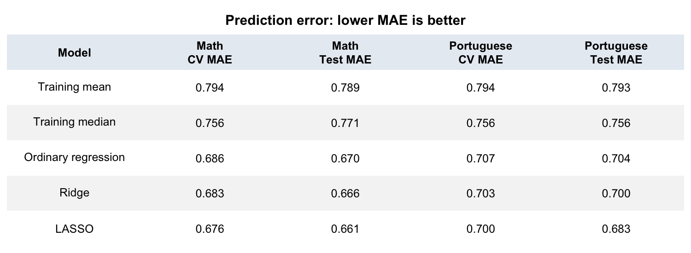
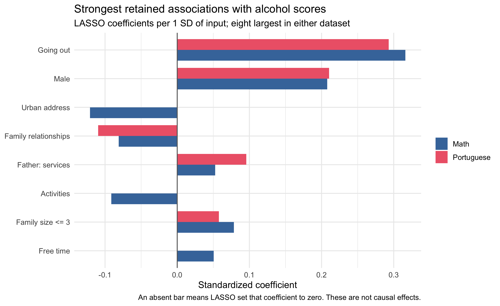
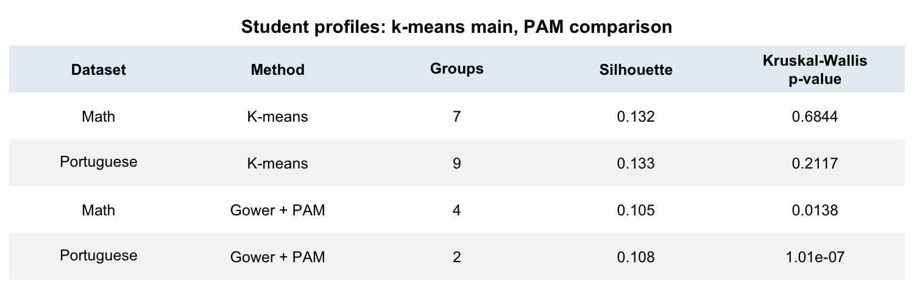
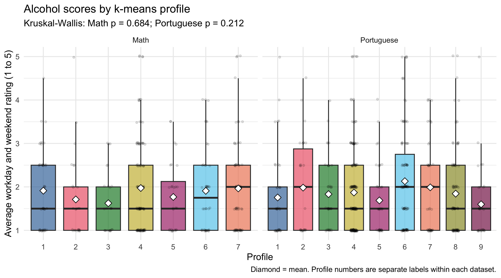

# Findings for the report

Math and Portuguese were analysed separately: **355 Math students** and **579 Portuguese students**. No model combines the two datasets.

Alcohol score = average of `Dalc` and `Walc`, on a 1 to 5 rating scale. It is not a weekly drink count.

## RQ1: What predicts alcohol consumption?

Each dataset used 70% training and 30% test students. Ordinary regression, ridge, and LASSO were compared using five-fold training cross-validation. **LASSO was selected in both datasets.**

MAE is the average absolute prediction error. LASSO misses by about **0.66 points in Math** and **0.68 in Portuguese**. Prediction is modest: test R² is 0.275 and 0.238. Higher alcohol scores are often underpredicted.

**Going out and male sex are the strongest retained predictors** in both datasets. Better family relationships are associated with lower predicted scores. These are associations, not causal effects.

Bars show coefficients per input SD, holding the other inputs constant. An absent bar means LASSO set that coefficient to zero.

## RQ2: Are there student profiles?

Clustering used all students within each dataset, with alcohol excluded. K-means used standardized inputs and 25 starts. The number of groups was chosen by silhouette score from 2 to 10.

**K-means did not find significant alcohol differences between profiles.** The groups largely reflect mother's job categories. Standardizing dummy columns increases the influence of rare categories. Silhouettes near zero indicate weak separation, so these are not clear alcohol-related student types.

Eliska's Gower + PAM analysis is an extra comparison, not a taught course method. It finds alcohol differences, but its groups also overlap substantially. In Math, only profiles 1 and 2 differ after Bonferroni correction (p = 0.00646). In Portuguese, profile 2 has a higher score than profile 1 (means 2.20 versus 1.70). The conclusion depends on the clustering method.

## Important limits

- Some students appear in both datasets, so the results are not independent.
- The data describe current associations, not causes or future risk.
- One MICE version per dataset was used. Imputation was not repeated inside each CV fold, although test students were excluded from fitting.
- Ratings are ordinal; averages and numerical models assume equally spaced steps.
- K-means chose 7 groups for Math and 9 for Portuguese. These are the best tested options, not established optima.
